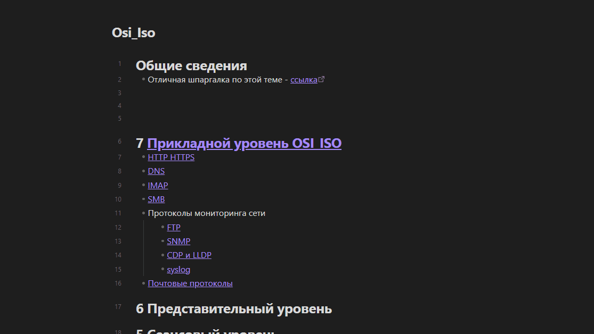

# Obsidian export helper

Export one Obsidian note with all linked notes and assets into a portable folder.  
Утилита для экспорта заметки Obsidian вместе со связанными файлами: вложенными заметками, markdown-ссылками, wikilink-ссылками и изображениями. Подходит, когда нужно быстро собрать отдельный кусок vault в переносимую папку.

## Демонстрация



На демонстрации показан типичный сценарий:

- открывается исходный файл в оригинальном Obsidian vault;
- видны подссылки и изображение, на которые ссылается заметка;
- запускается `obsidian-export-helper`;
- открывается экспортированный vault, где собраны исходная заметка и связанные файлы.

### Дополнительные флаги
```powershell
.\obsidian-export-helper.exe <source_file> [--vault_path <path>] [--output <path>] [--delete] [--folder] [--ignore-file <path>] [--report] [--verbose]
```

- `--vault_path` — корневая папка Obsidian vault. Если не задана, используется папка `source_file`. Если задана, `source_file` должен находиться внутри этой папки.
- `--output`, `-o` — путь назначения для файлов. Если папки нет, она будет создана.
- `--delete` — перемещать файлы (удалять из исходного места) вместо копирования.
- `--folder` — сохранять структуру папок относительно корня Obsidian.
- `--ignore-file` — путь к gitignore-подобному файлу исключений. Если флаг не задан, утилита автоматически использует `.obsidian-export-ignore` из папки, из которой запущена команда, когда такой файл есть.
- `--report` — создать markdown-отчёт `export-report-{filename}.md` рядом с бинарником, а при запуске из исходников — рядом с `main.py`.
- `--verbose` — подробные логи.

`source_file` должен быть markdown-файлом. Если указать имя без расширения, например `учеба`, утилита попробует найти `учеба.md`.
Если `source_file` попадает под правило исключения, экспорт не запускается и утилита выводит ошибку, что `source_file` занесён в список исключений.

После успешного экспорта в консоль выводится summary:

```text
Export complete:
- notes: 12
- images: 4
- missing links: 2
- ignored files: 3
- output: D:\Export
```

### Примеры
Скопировать все связанные файлы в папку `output` рядом с бинарником:
```powershell
.\obsidian-export-helper.exe "D:\Vault\Notes\index.md"
```

Сохранить структуру папок в пользовательский каталог:
```powershell
.\obsidian-export-helper.exe "D:\Vault\Notes\index.md" --folder -o "D:\Export"
```

Переместить файлы (удалить из исходника):
```powershell
.\obsidian-export-helper.exe "D:\Vault\Notes\index.md" --delete -o "D:\Export"
```

Указать корень Obsidian vault явно:
```powershell
.\obsidian-export-helper.exe "D:\Vault\Notes\index.md" --vault_path "D:\Vault"
```

Создать отчёт по экспорту:
```powershell
.\obsidian-export-helper.exe "D:\Vault\Notes\index.md" --vault_path "D:\Vault" -o "D:\Export" --report
```

Отчёт `export-report-index.md` создаётся рядом с бинарником или `main.py` и содержит основные параметры запуска, статистику, список скопированных/перемещённых файлов, пропущенные файлы и отсутствующие ссылки.

Исключить файлы из обработки и экспорта:

```gitignore
# .obsidian-export-ignore рядом с местом запуска команды
private/
drafts/*.md
*.psd
!drafts/keep.md
```

```powershell
.\obsidian-export-helper.exe "D:\Vault\Notes\index.md" --vault_path "D:\Vault"
```

## Разработка

### Требования
- Python 3.10+

### Запуск из исходников
```powershell
python main.py <source_file>
```

По умолчанию файлы копируются в `output/` рядом с `main.py`.

## Сборка бинарника

Локальная сборка для текущей ОС:

```bash
python -m pip install -r requirements-build.txt
pyinstaller --clean --noconfirm obsidian-export-helper.spec
```

Готовый файл появится в `dist/`.

## Релиз через GitHub Actions

Workflow `.github/workflows/release.yml` запускается при push тега `v*`, прогоняет тесты, собирает PyInstaller-бинарники и публикует архивы в GitHub Release:

- `obsidian-export-helper-windows-x64.zip`
- `obsidian-export-helper-linux-x64.zip`
- `obsidian-export-helper-macos-x64.zip`
- `obsidian-export-helper-macos-arm64.zip`

Пример релиза:

```bash
git tag v0.1.0
git push origin v0.1.0
```

## Архитектура проекта

### Поток выполнения
1. `main.py` принимает аргументы CLI и настраивает логирование.
2. `SearcherAllFiles` ищет ссылки в `source_file` и рекурсивно собирает связанные файлы.
3. `FileSetter` копирует или перемещает найденные файлы в целевую директорию.
4. После экспорта печатается summary и, если указан `--report`, создаётся markdown-отчёт.

### Основные модули
- `main.py` — CLI входная точка.
- `src/FileClasses/Searcher.py` — поиск ссылок (wikilink и markdown) и сбор зависимых файлов.
- `src/FileClasses/FileSetter.py` — копирование/перемещение файлов, сохранение структуры.
- `src/FileClasses/DirectoryWorker.py` — временная смена рабочей директории.
- `src/logger/logger.py` — логирование в консоль и файл.
- `src/lexicon/lexicon.py` — текстовые сообщения/подсказки CLI.

### Форматы ссылок
Поддерживаются:
- `[[link]]`
- `[[link|display]]`
- `[[link#section]]`
- `[[link#section|display]]`
- `[text](link)`
- `[text](link#section)`
- `[text](<link with spaces>)`
- `[text](file%20name.md)`
